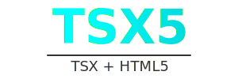

# TSX5

TSX5 é uma biblioteca minimalista que combina a sintaxe TSX com recursos nativos do HTML5, permitindo criar interfaces reativas e modulares sem depender de frameworks pesados. Ela oferece:

- **Runtime TSX Personalizado**  
  Converte a sintaxe TSX em elementos DOM por meio das funções `createElement` e `Fragment`.

- **Gerenciamento de Estado Reativo**  
  Utiliza `useState` e `useEffect` em conjunto com Proxy/Observer para rastrear alterações e atualizar o DOM de forma simples.

- **Roteamento Automático**  
  Mapeia automaticamente arquivos TSX na pasta `src/pages` para rotas, incluindo parâmetros dinâmicos (ex.: `/home/:id`).

- **Leve e Independente**  
  Baseado em TypeScript e APIs nativas do navegador, sem dependências de grandes frameworks.

---


## Início Rápido
Para iniciar um novo projeto com este template TSX5, execute:

```bash
npx degit SrJohnathan/tsx5-template my-project
cd my-project
npm install
npm run dev
```


## Exemplo Básico
Exemplo de um componente que usa estado reativo:

```tsx
import { createElement, useState, useEffect } from "tsx5-base";

function Counter() {
  const [getCount, setCount] = useState(0);

  useEffect(() => {
    console.log("Contagem atual:", getCount());
  });

  return (
    <button onClick={() => setCount(c => c + 1)}>
      Contagem: {getCount}
    </button>
  );
}

export default Counter;
```

Para renderizar no DOM:

```tsx 
import {render} from "tsx5-base";

const root = document.getElementById("root");
render(root!)
```

## Roteamento
Organize suas páginas em src/pages. Exemplos:

src/pages/index.tsx → Rota /

src/pages/about.tsx → Rota /about

src/pages/home/[id].tsx → Rota /home/:id

<!-- Se não estiver usando Vite (que fornece import.meta.glob), você pode criar um script Node para gerar um arquivo generated-routes.ts, que mapeia cada arquivo para sua rota correspondente.-->


## Contribuindo
Contribuições são bem-vindas! Abra issues ou pull requests com sugestões de melhorias ou correções.

## Licença
Este projeto está licenciado sob a MIT License. Sinta-se livre para usar e adaptar conforme necessário.
